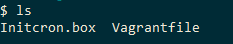

1) Download the box file from the below location:

  link
  screenshot  of the link


2) Now go to the place where you have downloaded the box file and
```
  vagrant box add <box-name> <downloaded file name>
```
  

3) We can check the box which we have added by:
```
  vagrant box list
```
  

4) We need to create a vagrant file. Vagrant file hold the information about the VM which we going to create. Ex: IP, RAM, Hostname.
```
  vagrant init <box-name>
```
  
  

5) Now if check the directory you are in there will be a file created in the name of Vagrantfile. We need to edit this file.
```
  vim Vagrantfile
```
6) Now add hostname, configure your desired IP and change the value of RAM from 1024 to 2048 and add the ip.

  

  

7) Now save the file, and
```
  vagrant up; vagrant ssh
```
  

  
